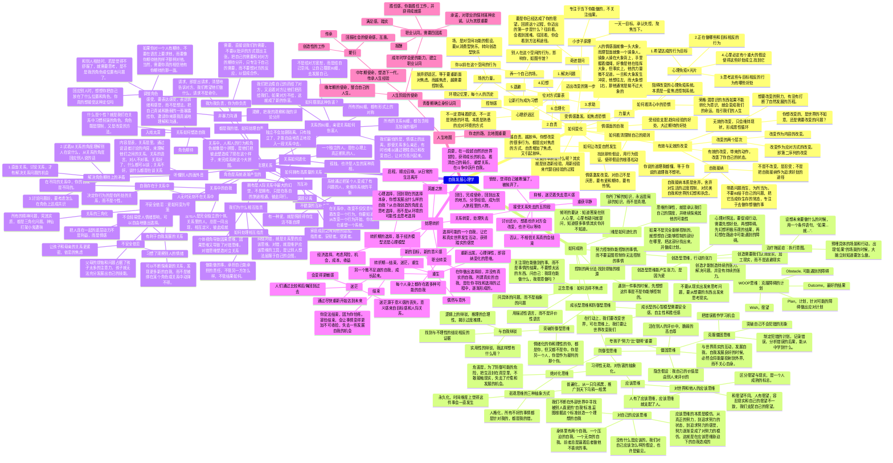

自我发展心理学，陈海贤

```mermaid
mindmap
    自我发展心理学
        id(如何变化)
            id(人的情感面就像一头大象，而理智面就像一个骑象人。骑象人骑在大象背上，手里握着缰绳，好像是他在指挥大象，但事实上，他的力量微不足道。一旦和大象发生冲突，他想往左，而大象想往右，那他通常是拗不过大象的)
            id(改变的本质是什么呢？其实就是创造新经验，用新经验来代替旧经验的过程)
            id[情感面的自我]
               力量大
               受情感激发。如焦虑恐惧
               受经验支配.趋向经验的好处，大过期待的好处
            id[心理舒适区]
                不一定意味着舒适，不一定是熟悉的环境。本质是熟悉的应对环境的方式
                应对方式量表
                    1.解决问题
                    2.自责
                    3.求助
                    4.幻想
                    5.退避
                    6.合理化
                控制感
                    放弃舒适区，等于要重新面对焦虑。而越焦虑，越需要控制感。
            id[如何看清心中的恐惧]
                阻碍改变的心理免疫系统。本质是一套焦虑控制系统。
                心理免疫X光片
                    1.希望达成的行为目标
                    2.正在做哪些和目标相反的行为
                    3.思考这些与目标相反的行为有哪些好处
                    4.心里必定有个重大的假设使得这些好处成立,找到它
                荣格:潜意识的东西如果不能转化为意识，就会变成我们的命运，指引我们的人生
            id[如何看清限制自己的规则]
                找到那些假设，用行为验证。使得假设的根基松动
            id[迈出改变的第一步]
                小步子原理
                    专注于当下你能做的，不关注结果。
                    一天一目标。承认失控，聚焦当下。
                奇迹提问
                     要是你已经达成了你的愿望。回顾这个过程，你迈出的第一步是什么？往前看，会看到困难。往回看，你会看到方法和途径。
            id[让新行为成为习惯]
                场的力量。
                    场，是对空间功能的假设。要从消费型快乐，转向创造型快乐
                    环境记忆里，每个人的历史
                养一个自己的场。
                    别人在这个空间的行为，影响你，如图书馆？
                    你以前在这个空间的行为
            id[如何让改变自然发生]
                越自责，越放纵。你想改变的很多行为，都是应对焦虑的方式，自责增加了焦虑，又引起放纵。
                情感激发改变。对自己不是厌恶，要有爱和期待，要有怜悯。
                你说的道理我都懂，等于 你说的道理我不想听。
            id[有效与无效的改变]
                改变的两个层次
                    改变作为内容的改变。
                    改变作为应对方式的改变。即第二序列的改变
                自我接纳
                    自我接纳本质是舍弃。舍弃对生活的过度控制，对完美自我和世界的幻想和执念。
                    不是不改变，是忍受；不是把自我接纳作为追求好处的途径
                    带着问题而生，为所当为。不要纠结于自己的问题，把它当成你生存的常态，专注于去做你想做的事
                有效的改变，带来的动作，改善了你自己的状态。
                无效的改变，只会维持现状，形成恶性循环
                    你想改变的，是世界的不如意，还是需要改变的问题？
                    想要改变的努力，有没有打断了自然发展的历程。
        id(如何成熟)
            id[成长型思维和防御型思维]
                成长型的心智模型需要安全感，自主性和胜任感
                    在行动上，我们要改变世界，可在思维上，我们要让世界改变我们
                防御型思维
                    僵固思维
                        活在别人的评价中，脆弱的高自尊
                        夸孩子"努力"比"聪明"重要
                        隐含假设：我自己的价值是由别人来评价的
                        与世界真实的互动，发展自我。自我发展良好的时候，必然会将能量投射到外界，而不关心自身。
                        克服僵固思维
                            把错误看作学习机会
                            突破自己不会犯错的形象
                            制定犯错的计划。记录错误，分析错误的后果，能从中学到什么。
                    应该思维
                        对世界和他人的应该思维
                            和愿望不同。人有愿望，容忍现实和自己的愿望不一致，我们支配自己的愿望。
                            人有了应该思维，应该思维就支配了人。
                            区分愿望与现实，是一个人成熟的标志。
                        对自己的应该思维
                            身体里有两个自我。一个压迫的自我，一个无奈的自我。前者总是逼着后者做他不喜欢的事。
                            没有什么是应该的。我们对自己应该怎么样的假设，也许是偏见。
                            应该思维的本质是模仿。从真正的努力，到追求努力的状态，到追求努力的感觉，努力逐渐变成了对努力的模仿。这就是在应该思维胁迫下的自我造成的
                            我们不断在外部世界中寻找被别人喜爱的”自我"标准,妄图根据这个标准创造一个理想的自我
                    绝对化思维
                        习得性无助，对伤害的抽象化。
                        悲观思维的三种抽象方式
                            永久化，时间维度上觉得这件事会一直发生
                            普遍化，从一只乌鸦黑，推广到天下乌鸦一般黑
                            人格化，所有不好的事情都是针对我的，都是我的错。
                        危害是，为了防御可能的危险，把生活封在真空里，不敢接触现实，失去了疗愈和发展的机会。
                突破防御型思维
                    与自我辩驳
                       找到与不理性的结论相反的证据
                       逻辑上的辩驳，推理的合理性，揭示过度推理。
                       实用性的辩驳，我这样想有什么用？
                    情绪化的你和理性的你，都是你，但又都不是你。你是另一个人，你是作为裁判的那个你。
            id[创造型思维，行动的张力]
                创造才能制造持续的张力，解决问题，并没有持续的张力。
                创造型思维能产生张力，是因为爱
                不要从现实出发来思考问题，要从想要的东西出发来思考现实。
                创造需要我们认清现实，加工现实，而不是逃避现实
                心理对照法。要促成行动，需要先想好处，再想障碍。先幻想积极乐观的结果，再幻想在路途中可能遇到的障碍。
                治疗拖延症：执行意图。
                   设想未来要做什么的时候，用一个条件语句，"如果...就...".
                   预埋具体的场景和行动。出现“如果”的场景的时候，大脑立刻知道要怎么做。
                WOOP思维：克服障碍的计划
                   Wish，愿望
                   Outcome，最好的结果
                   Obstacle, 可能遇到的障碍
                   Plan，计划，针对可能的障碍做出应对计划
            id[控制的两分法:找到烦恼的根源]
                努力控制你能控制的事情，而不要妄图控制你无法控制的事情
                遇到一件事的时候，先想想这件事是不是你能够控制的。
                如果不是完全能够控制的，就想想自己能够控制的部分在哪里，把这部分找出来，并做成计划。
            id[正念思维：如何活得不焦虑]
                用描述性语言，而不是评价性语言
                问具体的问题，而不是抽象的问题
                关注现在能做到的事，而不是事情的结果。不要想太远的东西。问自己：我现在能做什么，我愿意做吗？
            id[思维是如何进化的]
                倾听的要诀：知道答案在别人心里，心里有疑问就提问，知道很多事情其实你并不知道。
                你所了解的知识，永远是局部的知识，而不是真理。
                思维的弹性，就是承认我们自己的限度，并继续探索其他的可能性
        id(管理关系)
            id[关系中的自我]
                没有人是完全独立的个体。关系里的人，总是一同出现，相互定义，彼此成就
                自我存在于关系中
                    人无时无刻不在关系中
                    在不同的关系中，你的自我是不同的。
                    决定你行为的是你所处的关系，而不是个性。
            id[关系如何塑造自我]
                入戏太深
                角色期待
                调整角色
                    回应别人时，想想你把自己放在了什么位置和角色，你真的想接受这种定位吗
                    和别人相处时，若是觉得不舒服了，就需要思考，是不是我的角色或位置有问题了。
                    如果你对一个人有期待，不要在语言上要求他，而要像你期待他的样子那样对他。当然，需要你真的相信他有你期待的那一面。
                什么是个性？就是我们在关系中习惯扮演的角色。角色既是限制，又是改变的方法。
            id[听懂别人的画外音]
                内容是表，关系是里。通过说话者讨论的内容，来理解他们之间的关系。关系的语言，对人不对事。关系好了，什么都可以谈；关系不好，谈什么都是在谈关系
                解决角色期待上的矛盾
                   1.直面关系，讨论关系，才有解决关系问题的机会
                   2.试着从关系的角度理解别人在说什么，从关系的角度回应别人说的话
                   3.讨论问题前，要考虑怎么在角色上达成共识
            id[关系的互补]
                角色是系统逐渐产生的
                关系中，人和人的行为和角色就像是个拼图，是他们把彼此塑造成了现在这个样子，来完成系统这个大拼图。
                不健康的互补关系
                     有一种爱，就是照顾得你生活不能自理
                     系统通过把某个人变成了有问题的人，来维持系统的平衡
                     家庭成员之间角色的混乱。指责者，安慰者，受害者。
                在关系中，改变不仅仅意味着改变一个行为，你要知道从改变一个行为开始，你就在重塑一个系统。
            id[不安全依恋：爱如何变为牢笼]
                有利于自我发展的关系
                   不会轻易受人情绪影响，可以自由地做出选择。
                   可以不断探索新的关系，发现更多新的自我，而不是被绑在某个角色或关系中动弹不得。
                把人连在一起的底层动力不是利益，而是情感
                不安全依恋
                   父母的烦恼和问题占据了孩子太多的注意力，孩子就无法充分发展出自己的技能。
                   习惯了观察别人的情绪
                   让孩子和母亲的关系更紧密，依恋的焦虑
                关系的三角化
                   所有的精神问题，究其实质，都是三角化问题。神仙打架小鬼遭殃
            id[我们为什么相互指责]
                个体视角导致因果思维，因果思维又导致了对错思维。对错思维塑造对立关系
                纠结对错，就是关系里的应该思维。对错，就是维护应该思维的工具，是让别人想法屈服于自己的企图。
                如何处理相互指责
                    做能做的事。承担自己能承担的责任，不管另一方怎么样，不管结果如何。
            id[都是我的错，如何处理自责]
                我为我负责，你为你负责
            id[关系的纠缠，亲密关系如何伤害人]
                所有的关系纠缠，都包含相互加强的循环
                所有的纠缠，都有形式上的对称
                我们最怕的是，情感上的远离。即使关系多么亲近，有时也难以通过牺牲自己和改变自己，让对方高兴起来。
                我们把治愈自己的药给了对方，又追着对方让他们把药给我们。如果对方不给，这就成了新的伤害。
                如何摆脱这种伤害？
                   不是给对方宽恕，而是给自己空间。让自己摆脱纠缠，去发展自己。
            id[如何拥有高质量的关系]
                课题分离
            id[非暴力沟通]
                观察，把我的观察和我的评论分开
                感受，要表达感受，表达情绪和感觉，而不是想法。把自己真诚和脆弱的一面暴露给你，邀请你来跟我真诚地理解和沟通。
                需要，直接说我们的需要，不要以批评的方式提出主张。把自己的需要和对对方的期待分开，只专注于自己的需要，而不要想对方的反应，以促成合作。
                请求，即提出请求，清楚地告诉对方，我们希望他们做什么。请求不是命令。
            id[关系如何进化]
                一个独立的人，是在心理上真正断乳的人。
                孤独，也许是人生的某种真相。
                拥有是人际关系中最大的幻觉，不是拥有，只是在各自的旅途相遇，彼此同行。
                独立不会加剧隔离。只有独立了，才能自由地真正地投入一段关系中去。
        id(处理转折)
            id[转折期---结束，迷茫，重生]
                结束
                   你没法结束，因为你怕疼。害怕结束，会让事情变得更加不可收拾，失去一些发展自我的机会
                迷茫
                   迷茫源于意义感的丧失。意义感来自目标感和人际关系。
                   人们通过比较和后悔回到过去
                   通过尽快重新开始达到未来
                   会变得更敏感
                重生
                   重新出发。心理弹性，即容纳变化的思维。
                   偶然与意外
                   另一个微不足道的自我，成长起来。
                   新的目标，新的意义感
            id[职业转变]
                每个人身上都存在着多种可能的自我
                在你做出选择前，并没有真实的自我。所谓真实的自我，是在你寻找和选择的过程中，逐渐形成的。
                选择可能的一个自我，让它和真实世界发生互动，获得踏实的感觉
            id[关系转变，处理失去]
                接受关系失去的五阶段
                   否认，不相信关系真的会结束
                   愤怒，觉得自己被欺骗了，被抛弃了。
                   讨价还价，想着也许对方会改变，也许可以等待
                   抑郁，迷茫着失去意义感
                   重获平静
            id[转折期的选择，基于经济模型还是心理模型]
                经济选择，考虑风险，机会，成本，收益
                心理选择，回到现在的选择本身，你想发展出什么样的自我？从自我创造的角度去思考选择，而不是从环境的可能性去思考选择
            id[英雄之旅]
                启程，顺应召唤，从日常的生活离开
                启蒙，在一段超自然的世界冒险，获得成长的机会。看清自己的弱点，重塑关系。在斗争中跃升自我。
                回归，完成使命，回到出发的地方。分享经验，成为别人旅程里的人物。
        id(人生地图)
            人生阶段的使命
                青春期确立身份认同
                成年时学会爱的能力，建立职业认同
                   职业认同。需要四因素
                   　　胜任感，你能胜任工作，并获得成就感
                   　　承诺，对职业的保持某种忠诚，认为其很重要
                   　　报酬
                   　　满足感，踏实
                中年期使命，塑造下一代，传承人生经验
                　　繁衍
                　　　　创造性的工作
                　　　　传承
                　　　　回报社会的使命感，互惠。
            　　晚年期的使命，整合自己的人生。
            你走的路，比地图重要
                　　　　
```